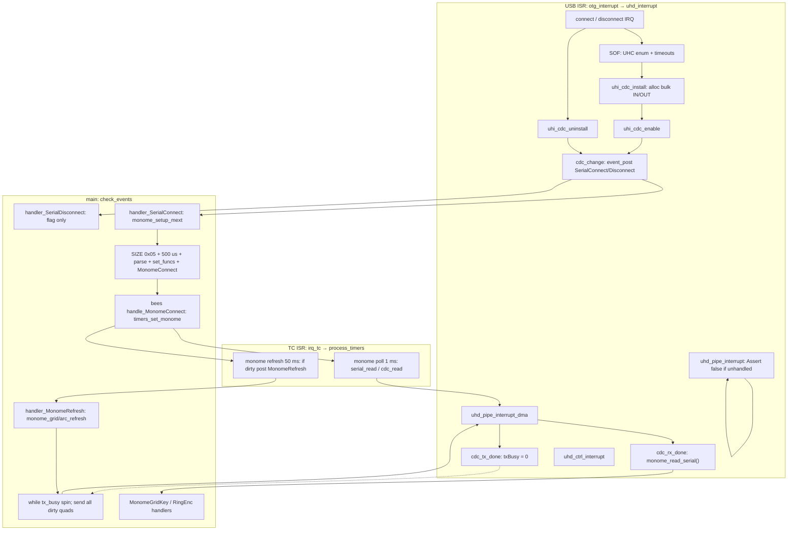
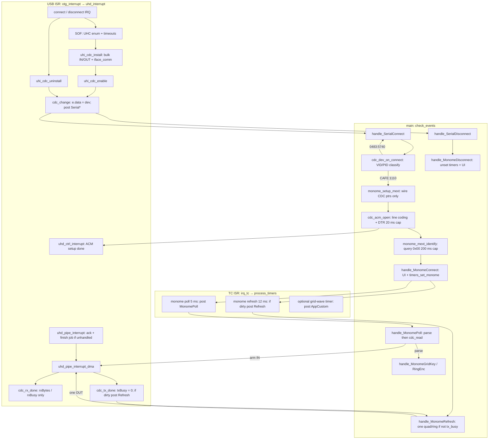

# CDC grid/arc change details

this report compares the **original bees + stock libavr32 CDC monome
path** with the **device-test + modified CDC / libavr32 / ASF path** that
got iii grid and arc working without locking the aleph event loop.

it covers:

1. control flow for connection, protocol selection, key/enc polling, LED
   refresh, and disconnect — including **where work runs** (main loop,
   USB ISR, TC timer callbacks) and **which ISRs** are involved.
2. diagrams for each implementation.
3. a summary table of what was added, removed, and changed.
4. per-change explanation at the ASF, libavr32, aleph/app, device-test
   CDC, and device-test app layers.

related short overview: [CDC.md](CDC.md). that file still describes the
classify/dispatch sketch; this file is the source of truth for the
identify-after-ACM and event-loop USB rules that actually shipped.

libavr32 commits on `fix/hid-boot-mouse-rx` (ahead of origin):

- `8141cdd` feat(cdc): open ACM and identify mext over CDC
- `fd0dc50` feat(cdc): chain monome refresh on TX complete

device-test commits on `feat/cdc-device-mux`:

- `5b45104` feat(device-test): classify CDC monome and poll keys
- `d88e194` feat(device-test): enable monome LED refresh
- `a4d102b` feat(device-test): add grid wave mode and richer arc/grid UI

`vendor/aleph` was **not** modified. bees still uses the original
handlers and timer periods. the libavr32 API split
(`monome_setup_mext` vs `monome_mext_identify`) is a behavioral change
bees would need to adopt if rebuilt against this libavr32.

---

## shared hardware and ISR map

both implementations sit on the same aleph AVR32 host stack. USB and
timers are interrupt-driven; the application is a single-threaded event
loop in `main()`:

```text
while (1) { check_events(); }
```

`check_events()` dequeues one `event_t` and calls
`app_event_handlers[e.type](e.data)`. if the queue is empty it runs
`app_idle_handler` (device-test: OLED `render_frame_service`). OLED
heartbeat and soft-power handling live on this loop. **if a handler
spins, the box looks dead even though USB IRQs still run.**

### ISRs that matter for CDC

| ISR | source | priority notes | what it does for CDC |
|-----|--------|----------------|----------------------|
| `otg_interrupt` | USBB (`AVR32_USBB_IRQ_GROUP`) | `UHD_USB_INT_LEVEL` (0, low) | ASF OTG entry. host mode calls `uhd_interrupt()`. |
| `uhd_interrupt` (called from OTG ISR) | same | same | demux: SOF, control pipe 0, bulk pipe, pipe DMA, connect/disconnect, VBUS. |
| `uhd_sof_interrupt` | USB SOF (~1 ms FS) | USB ISR | UHC enumeration timeouts, setup timeouts, bulk transfer timeouts, `uhc_notify_sof`. CDC `sof_notify` is **NULL**. |
| `uhd_ctrl_interrupt` | control EP0 | USB ISR | ACM `SET_LINE_CODING` / `SET_CONTROL_LINE_STATE` completion. |
| `uhd_pipe_interrupt` | bulk pipe IRQ | USB ISR | non-DMA bank / ZLP / stall / error. **original**: unhandled case was `Assert(false)` (compiled out → livelock). |
| `uhd_pipe_interrupt_dma` | USBB DMA | USB ISR | completes `uhd_ep_run` jobs; invokes `cdc_rx_done` / `cdc_tx_done`. |
| `uhc_notify_connection` / UHC enum | USB ISR (connect + SOF-stepped enum) | USB ISR | `uhi_cdc_install` then later `uhi_cdc_enable` / `uhi_cdc_uninstall`. |
| `irq_tc` | app timer/counter | `APP_TC_IRQ_PRIORITY` | increments `tcTicks`, calls `process_timers()`. software timer callbacks run **here**. |
| GPIO port IRQs | switches / encoders | UI priority | not CDC; they only post UI events. |
| `irq_usart` | debug UART | UI priority | `print_dbg` is mostly polling UART. calling it from USB/TC ISR stalls that ISR. |

`event_post()` from an ISR is the intended way to reach the main loop.
starting another `uhd_ep_run` on a pipe that already has a job, or
spinning on `tx_busy` / `rx_busy` on the event loop, is how the original
path died.

### USB pipes used

iii (`VID 0xCAFE` `PID 0x1110`) enumerates as CDC ACM:

- comm interface (usually 0): class requests only. **no interrupt
  endpoint is allocated** by `uhi_cdc_install`.
- data interface: bulk IN `0x82`, bulk OUT `0x02`.

FTDI monomes are a different UHI (`uhi_ftdi`) and are unchanged.

---

## original implementation (bees / stock libavr32)

stock here means libavr32 at `62fa3f1` (before the CDC ACM/identify
commits) plus aleph defaults in `vendor/aleph/avr32/src/main.c` and bees
timers/handlers.

### connection

1. USBB connect IRQ → UHC reset/enum (SOF-stepped, USB ISR).
2. `uhi_cdc_install` (USB ISR): walk config descriptor; if a CDC **data**
   interface is present, allocate bulk IN/OUT. comm interface number is
   **not** recorded. no ACM class requests.
3. `uhi_cdc_enable` (USB ISR) → `cdc_change(dev, true)`:
   - sets `connected = true`
   - posts `kEventSerialConnect` with **`e.data` left unset** (garbage /
     previous event data). VID/PID cannot be read from the event.
4. aleph default `handler_SerialConnect` (event loop):
   - if app not launched yet, set `cdcConnect` flag
   - **always** call `monome_setup_mext()` — every CDC device is treated
     as a monome. no crow / unknown split.

`uhi_cdc_install` / `enable` only post an event and (in the new tree)
print. they must not block; they already run in the USB ISR.

### protocol selection

`monome_setup_mext()` (event loop, called directly from SerialConnect):

1. wire function pointers: `serial_read/write` → `cdc_read/write`,
   `tx_busy` / `rx_busy` / `rx_buf` / `rx_bytes` / `serial_connected`.
2. send mext **SIZE** command `0x05` (`serial_write`).
3. `delay_us(500)` then `serial_read()` (arm one bulk IN).
4. **immediately** read `rx_buf()` without waiting for `rx_busy` to
   clear. if the first byte is `3` (SIZE reply), take cols/rows. if
   `cols == 0`, call it an arc.
5. `set_funcs()` + `monome_connect_write_event()` → `kEventMonomeConnect`.

this is a different path from FTDI `setup_mext()`, which sends query
`0x00` and **spins `while (rx_busy)` with no timeout** on the event
loop.

iii problems with the CDC path:

- most ACM devices (including iii) stay mute until DTR/RTS
  (`SET_CONTROL_LINE_STATE`). original never sent that.
- iii identity is query `0x00` → `0x00, type, count`, not SIZE `0x05` →
  `0x03, cols, rows`.
- 500 µs is not enough for a bulk IN even if the device answered.
- SIZE-as-arc (`cols == 0`) mis-identifies a silent device as a 16×8
  grid (the sane defaults) or an arc.

bees `handle_MonomeConnect` → `net_monome_connect()` →
`timers_set_monome()`.

### key / enc polling

bees `app_timers.c`:

```text
timer_add(monomePollTimer, 1, monome_poll_timer_callback)
```

`irq_tc` → `process_timers()` → **`serial_read()` / `cdc_read()` inside
the 1 ms TC ISR**. that starts `uhd_ep_run` on bulk IN from timer IRQ.

when the IN completes, `uhd_pipe_interrupt_dma` (USB ISR) calls
`cdc_rx_done`, which:

- writes `rxBytes`
- if `rxBytes != 64`, calls `(*monome_read_serial)()` **in the USB DMA
  callback**
- then clears `rxBusy`

`monome_read_serial` parses mext and `event_post`s
`kEventMonomeGridKey` / `kEventMonomeRingEnc`.

aleph default `handler_MonomePoll` is `monome_read_serial()` only. bees
does **not** override `kEventMonomePoll`. the 1 ms timer never posts
that event; it talks to USB itself. `kEventMonomePoll` is effectively
unused on the bees CDC path.

### refresh

bees:

```text
timer_add(monomeRefreshTimer, 50, monome_refresh_timer_callback)
```

TC callback: if `monomeFrameDirty > 0`, `event_post(kEventMonomeRefresh)`.

aleph default `handler_MonomeRefresh`: `(*monome_refresh)()`.

`monome_grid_refresh` / `monome_arc_refresh` (event loop):

- for **every** dirty quadrant / ring, `while (tx_busy()) { }` then
  `monome_grid_map` / `monome_ring_map` → `cdc_write` → `uhd_ep_run` OUT
- after the last map, **spin again** until `tx_busy` is false

`cdc_tx_done` (USB ISR) only cleared `txBusy`. it did not post another
refresh.

if the OUT never completes (device not talking, pipe wedged, second DMA
started on a busy pipe), `tx_busy` stays true forever and
`check_events` never returns. OLED heartbeat and soft power die. USB
unplug can still print `cdc unplug` because that path is the USB ISR.

### disconnect

1. USBB disconnect IRQ → UHC → `uhi_cdc_uninstall` (USB ISR) →
   `cdc_change(dev, false)` → `kEventSerialDisconnect` (`e.data` unset).
2. aleph `handler_SerialDisconnect`: if not launched, clear `cdcConnect`.
   **does not post `kEventMonomeDisconnect`.**
3. bees does not override SerialDisconnect. CDC unplug therefore does
   **not** stop monome poll/refresh timers.

FTDI unplug is different: `handler_FtdiDisconnect` posts
`kEventMonomeDisconnect`, and bees `net_monome_disconnect()` calls
`timers_unset_monome()`.

original `uhi_cdc_uninstall` also had `Assert(uhi_cdc_dev.report!=NULL)`
(a leftover HID field that does not exist on the CDC struct). asserts
are compiled out on this target, so it was a no-op, not a crash.

### original control-flow diagram



context labels in the diagram:

| node | context |
|------|---------|
| install / enable / uninstall / `cdc_change` | USB ISR |
| `cdc_rx_done` parse | USB DMA ISR |
| `cdc_read` | **TC ISR** (1 ms) |
| `monome_setup_mext` SIZE + connect | event loop |
| refresh spin + all quads | event loop |
| SerialDisconnect | event loop; **no monome teardown** |

---

## new implementation (device-test / modified CDC / libavr32 / ASF)

rules that recovered a live event loop:

- **no bulk IN/OUT from `irq_tc`.**
- **no parse in `cdc_rx_done`.**
- **no `uhd_ep_run` from `cdc_tx_done`.**
- **never `uhd_ep_abort` / `uhd_reset_pipe` after a live CDC transfer**
  without also acking the pipe IRQ (compiled-out asserts used to
  livelock here).
- **never clear `txBusy` / `rxBusy` while a USB job is still running**
  (that starts a second DMA on the same pipe).
- **one OUT per refresh handler**; return if `tx_busy`.
- ACM DTR before any mext traffic.
- identify with bounded waits, not infinite `while (rx_busy)`.

### connection

1. same USBB / UHC enum in the USB ISR.
2. `uhi_cdc_install` (USB ISR):
   - logs VID:PID
   - records `iface_comm` from the CDC comm interface (class `0x02`)
   - allocates bulk IN/OUT on the data interface (class `0x0A`)
   - still ignores the CDC interrupt endpoint
3. `uhi_cdc_enable` → `cdc_change(dev, true)` (USB ISR):
   - `e.data = (s32)dev` so the event loop can read VID/PID
   - prints `cdc plug` + IDs
   - posts `kEventSerialConnect`
4. device-test `handle_SerialConnect` (event loop):
   - `cdc_dev_on_connect(data)`: snapshot VID/PID, `cdc_classify_ids()`
   - **monome (`CAFE:1110`)**: `monome_setup_mext()` **wires callbacks
     only** (default 16×8 grid descriptor; no USB, no connect event)
   - then `cdc_acm_open()` → `uhi_cdc_acm_open()`:
     - `SET_LINE_CODING` 115200 8N1 (dummy; USB is baud-less)
     - `SET_CONTROL_LINE_STATE` DTR+RTS
     - each control xfer waits up to **20 ms** (`200 × 100 µs`)
   - then `monome_mext_identify()` (still on the event loop)
   - crow (`0483:5740`): log only
   - unknown: log VID:PID; do not wire monome

`monome_setup_mext` no longer queries or posts `kEventMonomeConnect`.
that is why aleph/bees would stall at “CDC plugged, never a monome” if
rebuilt against this libavr32 without a matching handler change.

### protocol selection

`monome_mext_identify()` (event loop, after ACM):

1. one OUT `0x00` (mext query), wait up to **200 ms** for `tx_busy`.
2. one IN, wait up to **200 ms** for `rx_busy`.
3. parse `0x00, type, count`:
   - type `1` count `1` / `2` / `4` → 8×8 / 16×8 / 16×16 grid
   - type `5` → arc with `count` encoders
4. on timeout or bad frame: **fallback 16×8 grid** (still posts connect
   so diagnostics work).
5. `set_funcs()` + `kEventMonomeConnect`.

`cdc_probe_mext_identity()` is a separate bounded query (8 tries, 20 ms
waits) for unknown VID/PID. it is **compiled in but not called** on the
current connect path; iii is classified by ID alone.

`handle_MonomeConnect` (event loop): OLED UI, `take_focus(FOCUS_MONOME)`,
`timers_set_monome()`.

### key / enc polling

device-test timers:

```text
timer_add(monomePollTimer, 5, monome_poll_timer_callback)
```

TC callback **only** `event_post(kEventMonomePoll)`. no USB.

`handle_MonomePoll` (event loop):

1. abort if `!cdc_connected()`
2. if `0 < rx_bytes() < 64`, `(*monome_read_serial)()` — parse last IN
   here, not in the DMA callback
3. `serial_read()` / `cdc_read()` to arm the **next** IN

`cdc_rx_done` (USB ISR) only stores `rxBytes` and clears `rxBusy`.

`cdc_read` / `cdc_write` refuse a second `uhd_ep_run` if already busy.
`uhi_cdc_in_run` / `out_run` return false if `dev == NULL` or the EP was
never allocated (original would dereference NULL after unplug).

grid keys / arc deltas still become `kEventMonomeGridKey` /
`kEventMonomeRingEnc` from `monome_read_serial` (now on the event loop).
device-test handlers update OLED and LED buffers (`monome_led_set` /
arc triplet).

### refresh

```text
timer_add(monomeRefreshTimer, 12, monome_refresh_timer_callback)
```

TC callback: if dirty, post `kEventMonomeRefresh` (same idea as bees,
faster period).

`cdc_tx_done` (USB ISR): clear `txBusy`; if `monomeFrameDirty > 0`,
**post** `kEventMonomeRefresh`. it does not start the next OUT.

`handle_MonomeRefresh` (event loop): if still connected,
`(*monome_refresh)()`.

`monome_grid_refresh` / `monome_arc_refresh`:

- return immediately if `tx_busy()` or maps are unset
- send **one** dirty quadrant or ring
- rotate a cursor so each dirty region gets a turn
- return (no spin)

`cdc_write` ignores the call if `txBusy` is already true.

so a full 16×16 grid needs up to four OUT completions. the TX-complete
event plus the 12 ms timer keep the queue moving without blocking
`check_events`.

### disconnect

1. USB ISR: `uhi_cdc_uninstall` → `cdc_change(..., false)` → print
   `cdc unplug` → `kEventSerialDisconnect` with `e.data = (s32)dev`.
2. `handle_SerialDisconnect` (event loop): snapshot kind, then
   `cdc_dev_on_disconnect()`.
3. if kind was monome, post `kEventMonomeDisconnect`.
4. `handle_MonomeDisconnect`: `timers_unset_monome()` (also stops the
   grid-wave timer), clear UI / focus. **does not** walk
   `monomeLedBuffer` in a USB-sensitive way; it only clears dirty flags
   and local press/accum state.
5. crow / unknown: log only.

`cdc_clear_busy()` exists as a **software-only** flag clear (no pipe
reset). it is not used on the connect/identify path. `cdc_abort()` still
calls `uhd_ep_abort` and is **unsafe** after a live transfer on this
USBB port; it is not used by device-test.

### new control-flow diagram



context labels:

| node | context |
|------|---------|
| install / enable / `cdc_change` | USB ISR |
| `cdc_rx_done` / `cdc_tx_done` | USB DMA ISR (flags + maybe post event) |
| ACM control complete | USB control ISR; **waited from event loop** |
| poll/refresh timer callbacks | TC ISR, **post only** |
| classify, ACM open, identify, parse, one LED OUT | event loop |
| SerialDisconnect → MonomeDisconnect | event loop |

---

## summary: added / removed / changed

| area | original (bees / stock libavr32) | new (device-test / modified stack) | added | removed | changed |
|------|----------------------------------|------------------------------------|-------|---------|---------|
| USB connect event payload | `kEventSerialConnect` with unset `e.data` | `e.data = (s32)uhc_device_t*` | device pointer on the event | — | `cdc_change` |
| CDC classify | none; every CDC is a monome | VID/PID → monome / crow / unknown | `cdc_kind.h`, `cdc_dev.c` | blind `monome_setup_mext` on all CDC | SerialConnect handler |
| ACM | none | `SET_LINE_CODING` + DTR/RTS, 20 ms wait | `uhi_cdc_acm_open`, `iface_comm` | — | install records comm IF |
| `monome_setup_mext` | SIZE `0x05`, 500 µs, parse, `set_funcs`, post connect | wire CDC callbacks only | — | USB + identify + connect event from setup | API split |
| identify | SIZE, or FTDI `setup_mext` infinite `rx_busy` spin | `monome_mext_identify`: query `0x00`, 200 ms cap, type/count table | `monome_mext_identify` | infinite busy-wait identify | command `0x05` → `0x00` |
| unknown-ID probe | — | `cdc_probe_mext_identity` (present, unused on iii path) | probe helper | — | — |
| crow | would run monome setup | log only | `cdc_crow.h` stub | monome setup on crow | — |
| poll timer | 1 ms, **`cdc_read` in TC ISR** | 5 ms, **post `kEventMonomePoll` only** | event-loop arm of IN | USB from `irq_tc` | period 1 → 5 ms |
| RX complete | `cdc_rx_done` calls `monome_read_serial` in DMA ISR | `cdc_rx_done` sets flags only | parse in `handle_MonomePoll` | parse in USB ISR | — |
| `kEventMonomePoll` | aleph default = parse only; bees unused | parse last IN + `cdc_read` | device-test override | — | meaning of the event |
| refresh timer | 50 ms, post if dirty | 12 ms, post if dirty | TX-complete also posts refresh | — | period 50 → 12 ms |
| `monome_*_refresh` | spin `tx_busy`; send **all** dirty regions | no spin; send **one** region; cursor | cursor | `while (tx_busy)` | one OUT per call |
| `cdc_tx_done` | clear `txBusy` | clear + post refresh if dirty | refresh chain | starting OUT from ISR (never added) | — |
| `cdc_write` | start OUT if not busy | same, plus ignore if busy (no queue) | — | — | still drop-if-busy |
| disconnect | SerialDisconnect flag only; bees timers keep running | snapshot kind → `kEventMonomeDisconnect` → unset timers | monome teardown on CDC unplug | — | SerialDisconnect override |
| `uhi_cdc_in/out_run` | no NULL/EP checks | refuse if `dev == NULL` or EP 0 | guards | `Assert(report)` on uninstall | — |
| pipe abort | — | `cdc_abort` / `uhi_cdc_abort` exist; **not used** after live xfer | abort API | using abort on the stay-alive path | — |
| busy clear | — | `cdc_clear_busy` software-only (no pipe reset) | helper | `uhd_reset_pipe` after live CDC | — |
| ASF freeze wait | unbounded `while (!Is_uhd_pipe_frozen)` | 200000-iter guard then force freeze | timeout | infinite freeze spin | `usbb_host.c` |
| ASF unhandled pipe IRQ | `Assert(false)` compiled out → ISR livelock | freeze, ack, `uhd_pipe_finish_job(ABORTED)` | recovery | livelock | `uhd_pipe_interrupt` |
| LED / UI | bees ops | device-test OLED map, held-key LEDs, arc triplet, grid wave | render + SW0–3 / enc / wave timer | writing LED buffer while USB wedged (debug dead-ends) | — |
| FTDI monome | `kEventFtdiConnect` → `ftdi_setup` | unchanged | — | — | — |
| aleph defaults | SerialConnect → `monome_setup_mext` | **unchanged in aleph** | device-test overrides after launch | — | libavr32 callee no longer identifies |

---

## part 2: changes by layer

### ASF (`vendor/libavr32/asf/avr32/drivers/usbb/usbb_host.c`)

ASF host is the USBB driver. CDC never calls it directly except through
`uhd_ep_run` / `uhd_setup_request` / (avoided) `uhd_ep_abort`. two
failure modes showed up once iii stayed enumerated but transfers
misbehaved:

**1. unbounded `while (!Is_uhd_pipe_frozen)`**

locations: `uhd_ctrl_interrupt` (EP0 IN ACK) and
`uhd_pipe_interrupt_dma` (wait for DMA freeze).

why: on a quiet or wedged pipe the freeze bit never arrives. the wait
runs **inside the USB ISR** with interrupts masked for that handler, so
the CPU never reaches `check_events`. a 200000-iteration guard now
force-freezes the pipe and continues. that is a last-resort recovery,
not a substitute for avoiding abort/reset.

**2. unhandled `uhd_pipe_interrupt`**

original tail: `Assert(false)`. aleph builds compile asserts out, so an
unexpected pipe IRQ (seen after `uhd_reset_pipe` / `uhd_ep_abort` on a
live bulk pipe) fell off the end of the ISR **without acking**. the
peripheral kept re-entering `otg_interrupt`. UART still worked enough
to print later unplug logs; the main loop did not.

why the new tail exists: freeze the pipe, disable/ack bank and OUT/IN
ready, ack stall, `uhd_pipe_finish_job(..., UHD_TRANS_ABORTED)` so the
CDC callback can clear `txBusy`/`rxBusy`. this is what made
`cdc_abort()` after SIZE experimentally fatal, and why abort is not
used on the working path.

no other ASF files were changed. UHC enum, SOF, and pipe DMA completion
are still stock aside from those two guards.

### libavr32

#### `src/usb/cdc/cdc.c` / `cdc.h`

| change | why |
|--------|-----|
| `e.data = (s32)dev` on plug and unplug | HID already did this. without it, device-test cannot classify VID/PID from SerialConnect. |
| print `cdc plug` / `cdc unplug` + IDs | prove the USB ISR path is alive when the event loop is not. |
| `cdc_rx_done` no longer calls `monome_read_serial` | parse + `event_post` from DMA ISR raced with poll and ran mext on a USB stack frame. a full 64-byte IN is still treated as “not a frame” by the event-loop parser (`rx_bytes() != 64`). |
| `cdc_tx_done` posts `kEventMonomeRefresh` if dirty | one-quad refresh needs a kick when the OUT completes; waiting only on the 12 ms timer makes LEDs sluggish and can stall if the timer and `txBusy` interleave. posting from ISR is safe; starting the next OUT from ISR is not. |
| `cdc_acm_open()` wrapper | keep apps off `uhi_*` and match `cdc_read` / `cdc_write`. |
| `cdc_clear_busy()` software-only | an earlier fix cleared busy **and** reset pipes so identify could retry; reset livelocked the USB ISR. flags must only be cleared when no job is in flight. |
| `cdc_abort()` | leftover from that retry path; kept in the API, not used by device-test after a live transfer. |
| `rxErrCount` on failed `cdc_read` | `uhi_cdc_in_run` can fail after unplug; printing every failure floods UART from the event loop. |

#### `src/usb/cdc/uhi_cdc.c` / `uhi_cdc.h`

| change | why |
|--------|-----|
| log VID:PID and `in`/`out`/`comm_if` on install | confirm enumeration vs later ACM/identify failures. |
| `iface_comm` from CDC comm interface | ACM requests are addressed to the **comm** interface, not the data interface. without this, DTR goes to wIndex 0 by luck on iii (often IF 0) and would be wrong on other ACM layouts. |
| `uhi_cdc_acm_open` | iii (and stock ACM) will not answer mext until DTR. line coding 115200 8N1 is required by many ACM stacks even though the bulk pipes are baud-less. `usb_protocol_cdc.h` is not on the include path, so request IDs and the 7-byte line-coding payload are local. waits are 20 ms, not infinite. |
| NULL / EP-0 checks on `in_run` / `out_run` | original `uhd_ep_run(uhi_cdc_dev.dev->address, ...)` after unplug is a NULL deref. |
| `uhi_cdc_abort` | pairs with `cdc_abort`; same pipe-reset hazard. |
| drop `Assert(uhi_cdc_dev.report!=NULL)` on uninstall | field does not exist; leftover from HID copy-paste. |

`UHI_MCDC.sof_notify` remains NULL. CDC does not do work on SOF; UHC
still uses SOF for enum and transfer timeouts.

#### `src/monome.c` / `monome.h`

| change | why |
|--------|-----|
| `monome_setup_mext` is wire-only | SIZE+500 µs on the event loop blocked and identified wrong. ACM must happen first, and identify needs bounded waits. splitting keeps SerialConnect classify (`cdc_dev`) from talking USB inside the library setup helper. |
| `monome_mext_identify` | query `0x00` matches FTDI `setup_mext` and iii firmware. type `1`/`5` + count is the mext identity frame. 200 ms cap keeps OLED/soft-power alive if the device is silent. fallback 16×8 still posts connect so the app can show *something*. |
| `monome_grid_refresh` / `monome_arc_refresh` non-blocking + cursor | the old `while (tx_busy)` is the hang that killed heartbeat. one OUT per call matches one USB job; the cursor avoids starving later quads/rings. |
| FTDI `setup_mext` / `ftdi_setup` | **unchanged**. still has infinite `while (rx_busy)` on the event loop. out of scope for CDC. |

### aleph / app

`vendor/aleph` is still `d7ffa3e`. no aleph source was edited for this
work.

the **original** CDC behavior bees relies on lives here:

| file | role |
|------|------|
| `avr32/src/main.c` `handler_SerialConnect` | `monome_setup_mext()` for every CDC plug |
| `avr32/src/main.c` `handler_SerialDisconnect` | launch-time flag only |
| `avr32/src/main.c` `handler_MonomePoll` | `monome_read_serial()` |
| `avr32/src/main.c` `handler_MonomeRefresh` | `(*monome_refresh)()` |
| `avr32/src/main.c` `check_events` | one event per loop; idle handler if empty |
| `apps/bees/src/app_timers.c` | poll **1 ms USB-from-IRQ**, refresh **50 ms** |
| `apps/bees/src/net_monome.c` | start/stop those timers on MonomeConnect/Disconnect |
| `apps/bees/src/handler.c` | does **not** override SerialConnect/Disconnect/Poll/Refresh |

why aleph was left alone:

- device-test can override `app_event_handlers` in `app_launch` after
  `assign_main_event_handlers()`.
- changing aleph defaults would silently change bees (poll in IRQ,
  identify API, disconnect).
- bees + new libavr32 is **not** a drop-in: `monome_setup_mext` no
  longer posts `kEventMonomeConnect`. a bees port would need the same
  ACM + `monome_mext_identify` sequence on SerialConnect, event-loop
  poll, and non-spinning refresh (already in libavr32).

FTDI remains the aleph default: `kEventFtdiConnect` → `ftdi_setup()`.
device-test does not override FTDI.

### device-test CDC library (`apps/device-test/src/cdc/`)

mirrors the HID helper layout: classify + device façade + optional
probe. protocol implementation stays in libavr32 monome.

| file | what | why |
|------|------|-----|
| `cdc_kind.h` | `CDC_KIND_MONOME` / `CROW` / `UNKNOWN`; `cdc_classify_ids` | iii and crow share CDC ACM. treating crow as monome would run mext/ACM identify on the wrong firmware. IDs: crow `0483:5740`, iii `CAFE:1110`. |
| `cdc_dev.c` | snapshot `uhc_device_t` from the connect event; classify; wire monome only for `CDC_KIND_MONOME`; on disconnect post `kEventMonomeDisconnect` if it was a monome | keeps VID/PID/kind after the USB device pointer is gone; SerialDisconnect must snapshot kind **before** `cdc_dev_clear`. |
| `cdc_probe.c` | bounded mext `0x00` for unknown IDs | future / non-iii CDC grids without a stable VID. **not called** for `CAFE:1110` (ID is enough). 20 ms waits / 8 tries so a mute unknown cannot hang SerialConnect. |
| `cdc_crow.h` | stub comment | phase-1 crow is identify/log only; no poll or command UI yet. |

`cdc_dev.h` still mentions “IDs then bounded mext probe”; the probe is
not invoked from `cdc_dev_on_connect`. classification is IDs only.

`config.mk` adds `src/cdc/cdc_dev.c`, `cdc_probe.c`, and the include
path. no aleph makefile changes.

### device-test app

#### `handler.c`

overrides (after aleph defaults):

| handler | why |
|---------|-----|
| `handle_SerialConnect` | classify, ACM, identify. aleph default would only call the new wire-only `monome_setup_mext` and never connect. |
| `handle_SerialDisconnect` | turn a CDC unplug into monome teardown (aleph/bees never did). |
| `handle_MonomeConnect` | UI + `timers_set_monome`. must not write LEDs in a way that starts USB before timers exist; connect render zeros the buffer then dirties quads / paints arc triplets. |
| `handle_MonomeDisconnect` | stop poll/refresh/wave timers; drop focus. |
| `handle_MonomePoll` | parse on the event loop, then arm IN. this is the replacement for “USB in `irq_tc`” + “parse in DMA ISR”. |
| `handle_MonomeRefresh` | call `monome_refresh` only if still connected. default aleph handler is the same call; the important change is the **non-blocking** `monome_*_refresh` underneath. |
| `handle_MonomeGridKey` / `RingEnc` | OLED + LED feedback. |
| `handle_Switch0`–`3` | grid mode: keys / wave / placeholders (only with monome focus). |
| `handle_Encoder0`–`2` | wave shift, row multiply, period. |
| `handle_AppCustom` | wave tick from a software timer (posted from TC, drawn on the event loop). |

#### `app_timers.c`

| timer | period | TC callback | why |
|-------|--------|-------------|-----|
| monome poll | 5 ms | post `kEventMonomePoll` | 1 ms USB-from-IRQ was the first hang class. 5 ms is enough for keys/encs and leaves TC time for screen/encoders. |
| monome refresh | 12 ms | post `kEventMonomeRefresh` if dirty | 50 ms felt slow once refresh was one quad per event; TX-complete posting covers the fast path. |
| grid wave | 10–350 ms | post `kEventAppCustom` | diagnostic pattern; same “post, don’t draw in IRQ” rule. unset on monome disconnect. |

#### `render.c` / `app_device_test.c`

OLED grid (2×2 cells, 1 px gap), arc LED position `accum >> 2`, triplet
neighbors level 6 / center 15, held keys at 15, wave saw 0–11. these
are how we **see** that poll and refresh work; they are not required
for the USB state machine.

`app_launch` calls `assign_event_handlers()` so the overrides replace
aleph defaults. `app_idle_handler = render_frame_service` is the
heartbeat that proved the loop was alive during bring-up.

---

## dead ends (intentionally not in the stay-alive path)

these were tried while the event loop was dying. they are listed so they
are not reintroduced:

| attempt | why it failed |
|---------|----------------|
| `cdc_abort` / `uhd_reset_pipe` after SIZE or a stuck IN | unhandled pipe IRQ; USB ISR livelock. asserts compiled out. |
| `cdc_clear_busy` while a bulk IN was in flight | software thought the pipe was free; `cdc_read` started a second DMA. |
| `cdc_read` from `irq_tc` | USB submit from TC; collided with DMA completion and identify. |
| parse in `cdc_rx_done` | USB stack frame + re-entrancy into monome/event_post. |
| start the next OUT from `cdc_tx_done` | USB ISR submitting work on the same pipe. |
| infinite `while (tx_busy)` in refresh | event loop death; unplug logs still appeared (ISR). |
| wiping / filling `monomeLedBuffer` during a wedged connect | refresh handler spun on the dirty frame. |
| skipping ACM and blasting query/SIZE | iii silent; IN never completed. |

---

## what to take to bees (if/when)

if bees is rebuilt against this libavr32, SerialConnect must:

1. classify (or accept that crow will not be a monome).
2. `monome_setup_mext()` (wire only).
3. `cdc_acm_open()`.
4. `monome_mext_identify()`.
5. keep poll/refresh timers, but move `cdc_read` off `irq_tc` and keep
   the non-blocking refresh already in `monome.c`.

until then, bees on stock aleph + old libavr32 is unchanged; device-test
is the only app that exercises the new path.
